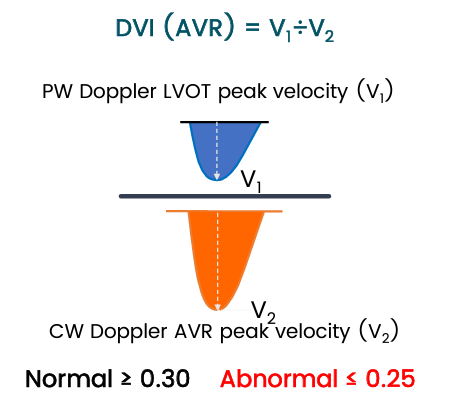
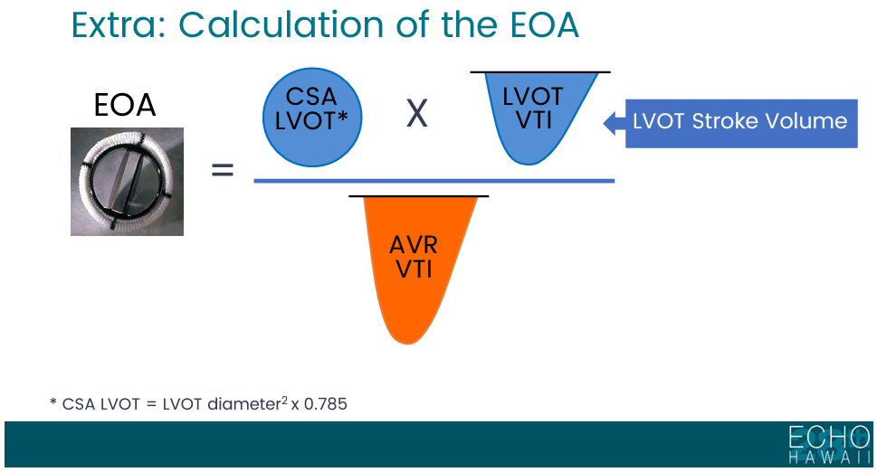
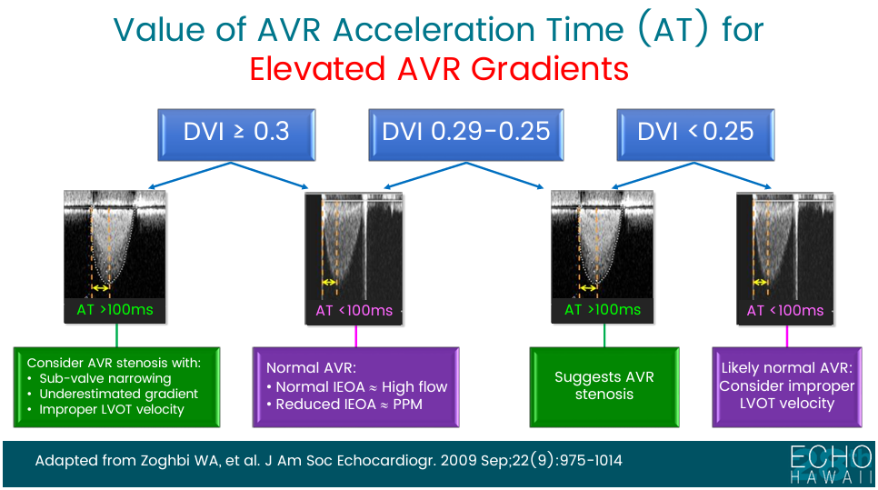
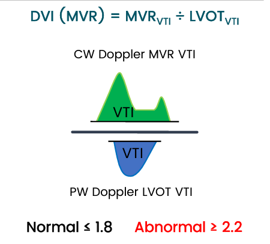
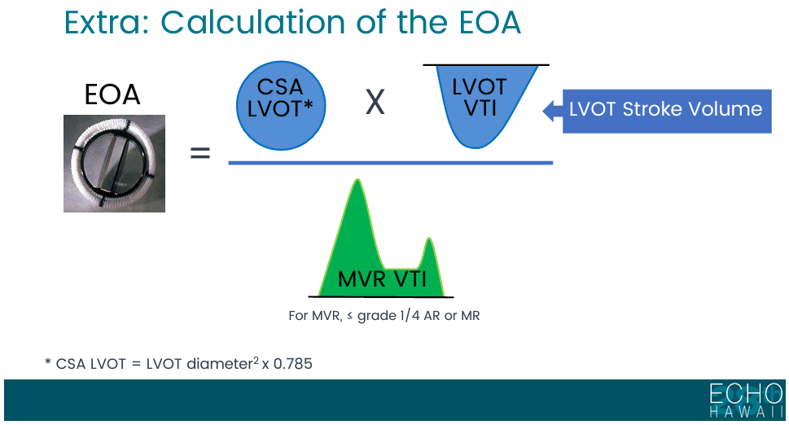

## Intro

- These are my personal notes concerning the echo evaluation of prosthetic heart valves

## AVR
<table class="striped" >
<thead data-theme="light">
<tr>
<th>Parameter</th>
<th>NL</th>
</tr>
</thead>
<tbody><tr>
<td>Peak V</td>
<td>&lt;3 m/s</td>
</tr>
<tr>
<td>Mean gradient</td>
<td>&lt; 20 mmHg</td>
</tr>
<tr>
<td>DVI</td>
<td>≥ 0.30</td>
</tr>
<tr>
<td>EOA</td>
<td>&gt; 1.2 cm2</td>
</tr>
<tr>
<td>Contour of the jet velocity</td>
<td>Triangular, early peaking</td>
</tr>
<tr>
<td>Accel. time</td>
<td>&lt; 80 ms</td>
</tr>
</tbody></table>

## Dimensionless Index

- For an AVR, calculate the DI like this:
-  courtesy of Bonita Anderson/ASE

## EOA

-  courtesy of Bonita Anderson/ASE

## Acceleration Time Algorithm

- 

## MVR
<table class="striped" >
<thead data-theme="light">
<tr>
<th>Parameter</th>
<th>NL</th>
</tr>
</thead>
<tbody><tr>
<td>Peak V</td>
<td>&lt;1.9m/s</td>
</tr>
<tr>
<td>Mean gradient</td>
<td>&leq;5 mmHg</td>
</tr>
<tr>
<td>DVI</td>
<td>&lt; 2.2</td>
</tr>
<tr>
<td>EOA</td>
<td>&geq; 2.0 cm2</td>
</tr>
<tr>
<td>Press. 1/2 time</td>
<td>&lt; 130 ms</td>
</tr>
</tbody></table>

## Dimensionless Index

- For an MVR, calculate the DI like this:
- 

## EOA

- 